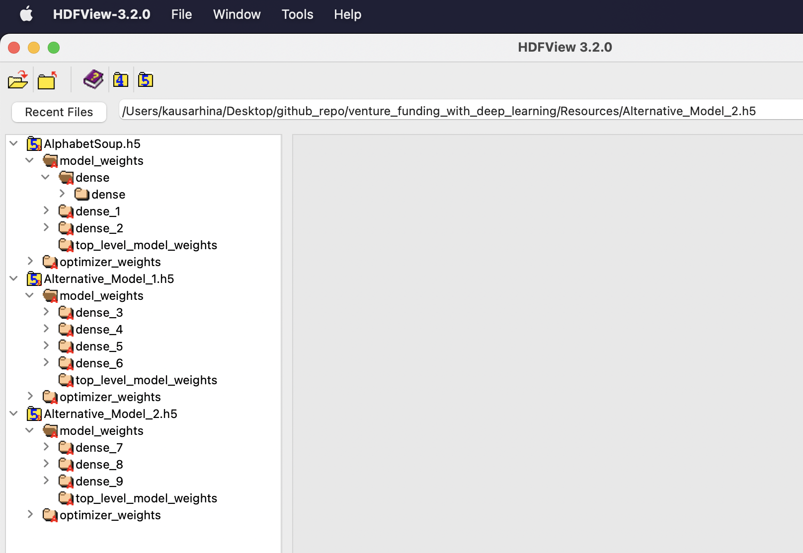

# venture_funding_with_deep_learning

The **venture_funding_with_deep_learning** is used by the Alphabet Soup (a venture capital firm ) to determine the funding for startups. It uses various techniques to create a model that predicts whether applicants will be successful if funded by Alphabet Soup or not.

---

## Technologies

This project leverages python 3.8.15 with the following packages:

* [pandas](https://pandas.pydata.org/) - For data analysis
* [scikit-learn](https://scikit-learn.org/stable/) - For Machine Learning in Python
* [tensorflow](https://www.tensorflow.org/) -  For creating machine learning models


---

## Installation Guide

Before running the application first install the following dependencies in conda dev environment.

```python

    conda create -n dev python=3.8 anaconda

    python -m ipykernel install --user --name dev

    conda activate dev

    conda install pandas
    pip install -U scikit-learn==1.1.0   
    pip install tensorflow

    conda deactivate 
  
```

---


## Usage

To use the venture_funding_with_deep_learning  application simply clone the repository and run the **venture_funding_with_deep_learning.ipynb** with jupyter lab:

```python
    conda activate dev

    jupyter lab

    conda deactivate 
```


Saved Models with HDFView




---

## Contributors

Kausar Hina

---

## License

MIT

